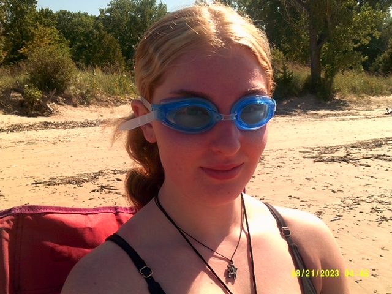

# rodriguez-ramos_d_HW1
Github collaborative project for HW1
## Team member - Cassidy Pelacek
I am from Ontario, I moved around throughout Ontario, never too far North though. I come from more of a country background, and I love nature and working with my hands. 

**hobbies:**
- lifting weights
- petting animals
- reading
- arts and crafts
- making clothes/costumes  

**some of my favourite things:**
- my dog
- everyone who has taught me lessons and life and supported me through my troubles
- good smells, like food, candles, fresh air
- water, both drinking, and swimming
- the outdoors

**skills:**
1. being a good friend
2. creativity
3. what my grandma would say is hard- headed but (never back down, never what?)

## Images that describe me

